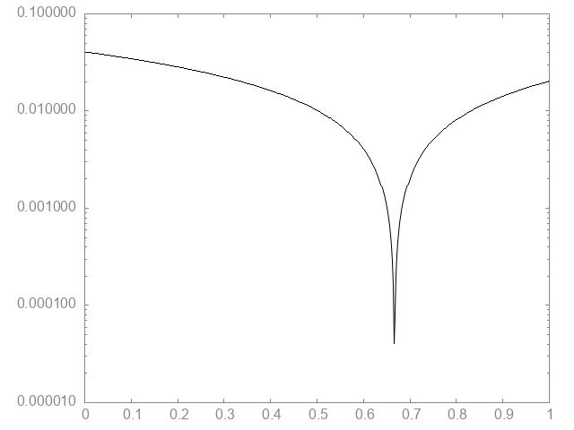
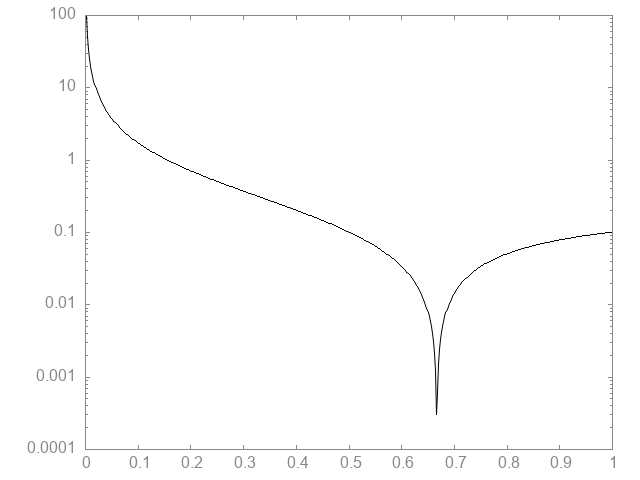

__Introduction__

A single header library for solving system of equations, for square or overdetermined matrices.

If `std::float128_t` is not available/supported, `long double` will be used.

__Dependencies__

- C++23 (optional)

__Note: Work in progress__

This project was made to solve a particular problem, so it lacks polish.

The goal was to solve the Kronrod extension of Lobatto Gauss quadrature.

Error estimate plot of problem, log scale on y axis to enhance location of solution:

Interestingly the plot depends on which rows are used to solve the matrix:

